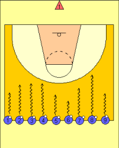

+++
title = '1 2 3 Soleil'
date = 2024-11-01T16:48:40+01:00
draft = false
tags = ["echauffement", "dribble"]
categories = ["u7"]
+++

### Matériel

* 1 ballon par joueur

### Déroulement

Les enfants ont chacun un ballon et sont sur une ligne à une dizaine de mètres de leur camarade
qui est au niveau d’un mur.\
Ce dernier se met face au mur et annonce le « 1, 2, 3 soleil »,
pendant ce temps, les enfants avancent en dribble vers le mur.

Si un enfant bouge ou ne réussit pas à stopper son dribble lorsque leur camarade se retourne, l’enfant doit repartir sur la ligne de
départ.

Le dernier enfant qui arrive au mur deviendra « l’annonceur » du « 1, 2, 3 soleil ».

Le premier enfant qui touche à deux reprises le mur le premier remporte le jeu.

### Evolutions

Demander à l’enfant qui est au niveau du mur de dire plus ou moins vite le « 1, 2, 3 soleil ».

Demander aux dribbleurs de stopper leur dribble en claquant leurs deux pieds au sol, le ballon au
dessus de la tête.

Disposer des cerceaux ou pastilles au sol, si les dribbleurs n’ont pas un pied dans un cerceau
lorsque leur camarade se retourne, il repart sur la ligne de départ.

Dribbler en marche arrière, main faible... 