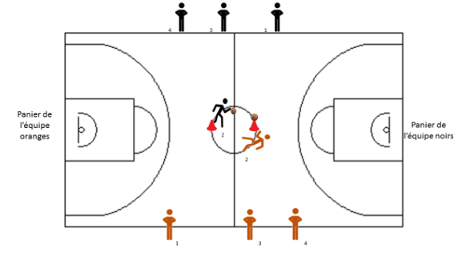

+++
title = 'Béret'
date = 2024-10-14T16:23:37+02:00
draft = false
tags= []
categories = ["u7"]
+++

### Matériel

* 2 paniers
* 1 ou 2 ballon(s)
* Des cerceaux ou pastilles de couleur

### Déroulement

Entre chaque camp, les bérets sont placés sur des plots. Chaque équipe a un béret.

Dans une équipe, chaque joueur doit avoir une couleur différente. Il y a autant de couleurs que le nombre de joueurs par équipe. Les joueurs des deux équipes doivent avoir les mêmes couleurs.

L’éducateur doit annoncer une couleur. Les deux joueurs de chaque équipe qui ont la couleur annoncée doivent aller chercher le béret puis aller marquer un panier dans le camp adverse. Le premier joueur qui marque permet à son équipe de marquer un point.