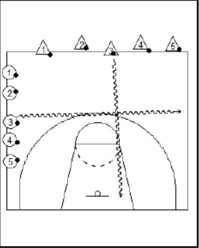

+++
title = 'Chassé Croisé'
date = 2024-11-09T13:34:02+01:00
draft = false
tags = ["dribble"]
categories = ["u7"]
+++

### Matériel

* 1 ballon par joueur

### Déroulement

Au signal, tous les enfants se déplacent en dribblant vers la ligne d'en face.

Petit à petit, réduire la largeur des lignes.