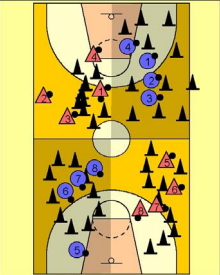

+++
title = 'Déménageurs'
date = 2024-11-09T14:24:47+01:00
draft = false
tags = []
categories = ["u7"]
+++

### Matériel

* 4 équipes
* 40 plots
* 2 ballons par équipe

### Déroulement

Manche de 1 minute 30

4 équipes, une équipe par quart de terrain.

L’objectif est de déménager les plots qui sont dans son camp vers un autre camp.\
Mais il faut marquer un panier pour pouvoir déménager un plot.\
Après avoir déménagé un plot ou raté le panier, je donne mon ballon à mon coéquipier qui est dans l’angle de mon camp.

L’équipe qui gagne est celle qui a le moins de plots dans son camp quand le sifflet retentit. 