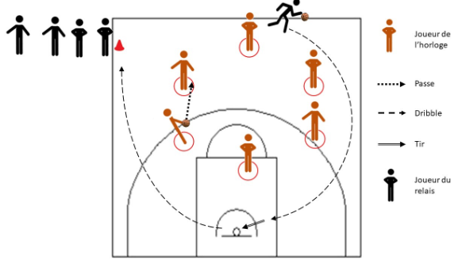

+++
title = 'Horloge Basket'
date = 2024-11-01T16:45:36+01:00
draft = false
tags = ["passe", "tir", "dribble"]
categories = ["u7"]
+++

### Matériel

* 2 ballons
* 1 panier
* 1 plot pour déterminer le départ du relais
* Des cerceaux pour désigner les positions de l’horloge

### Déroulement

Une équipe se place à la file indienne derrière le plot de départ du relais. Le premier joueur a un ballon. Chaque joueur de l’équipe adverse se place sur un plot de l’horloge. Un joueur a le ballon.

Au top départ, le premier joueur de la file indienne part en dribblant, contourne l’horloge, tire au panier, reprend le ballon, finit le tour de l’horloge en dribblant et donne le ballon au joueur suivant. Et ainsi de suite, jusqu’à ce que toute l’équipe soit passée. Quand toute l’équipe est passée, c’est la fin de la manche et les joueurs crient « Stop ».

Dans le même temps, les joueurs de l’équipe adverse se font des passes en rond dans le sens des aiguilles d’une montre. Ils comptent le nombre de tours qu’ils font.

A la fin de la manche, les rôles sont inversés.

### Evolutions

Lorsqu’un panier est marqué, l’équipe de l’horloge enlève un tour.