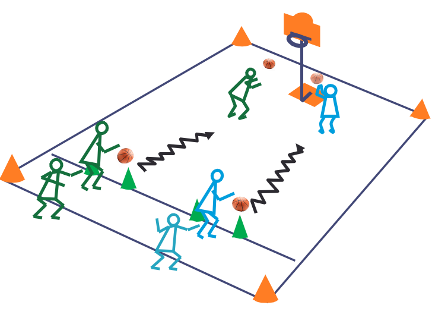

+++
title = 'Le Plus Rapide'
date = 2024-11-10T12:04:24+01:00
draft = false
tags = []
categories = ["u7"]
+++

### Matériel

* 1 ou 2 panier(s)
* 4 plots
* 4 ballons

### Déroulement

Au signal, le 1er joueur de chaque équipe avance en dribble jusqu'au panier. 

Le joueur n'a le droit qu'à une seule tentative.

Le joueur suivant démarre quand le joueur précédent a déclenché le tir.

La première équipe à 20 paniers, renporte la partie.

Pour les plus petits il est possible de faire un tour de chauffe.

### Variantes

Ajouter une passe en premier et un 2ème joueur qui va marquer.
