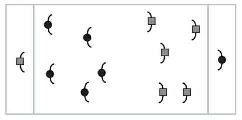

+++
title = 'Passe au Capitaine'
date = 2024-10-15T10:08:18+02:00
draft = false
tags= ["u7", "passe"]
+++

### Matériel

* 1 ballon
* 2 couleurs de chasubles

### Déroulement

Le but du jeu est de passer la balle au capitaine qui est dans sa zone en bout de terrain.

Le porteur de ballon n’a pas le droit d’avancer (ou est limité à trois pas).

Les remises en jeu se font sur la ligne de fond et chaque équipe dans son camp.

Le capitaine a le droit de se déplacer dans sa zone.
