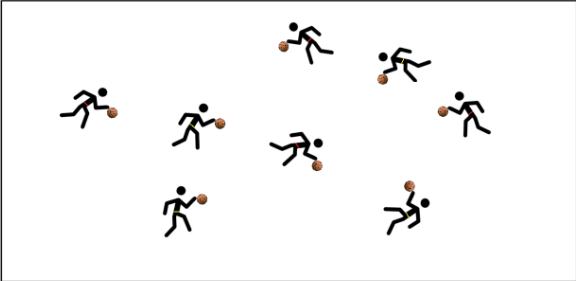

+++
title = 'Queue Du Loup'
date = 2024-10-15T10:09:23+02:00
draft = false
tags= ["echauffement"]
categories = ["u7"]
+++

### Matériel

* 1 ballon par enfant
* 1 chasuble par enfant

### Déroulement

Chaque joueur attache la chasuble à son short pour en faire une queue de loup.

Au signal de l'éducateur, il doit attraper la queue des autres joueurs.

Si un joueur perd sa queue, il doit s'arrêter et faire tourner le ballon 3 fois autour de la taille.

### Variantes

Organiser le jeu avec 2 équipes. Chaque équipe aura une couleur de chasuble différente.

Selon le niveau des élèves, une reprise de dribble ou un dribble à deux mains est un cas où le joueur est éliminé de la manche. Cette règle permet d’augmenter la difficulté de cet exercice de basket.