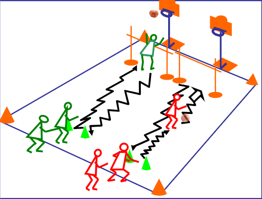

+++
title = 'Relais'
date = 2024-11-01T16:51:18+01:00
draft = false
tags = []
categories = ["u7"]
+++

### Matériel

* 2 équipes ou plus
* 1 cerceau par équipe
* 1 ballons par équipe
* 1 panier par équipe

### Déroulement

Au signal, le premier joueur de chaque équipe va le plus rapidement possible récupérer le ballon placé dans le cerceau.

Il va ensuite marquer un panier en dribblant. En cas d'échec, le joueur récupère sa balle et recommence le lancer.

Après avoir marqué, le joueur récupère la balle et la repose dans le cerceau.

Il retourne ensuite taper dans la main du joueur suivant.

L'équipe vainceur est celle dont tous les joueurs sont passés en premier.

### Variantes

* Ajouter des obstacles sur le parcours vers la balle et/ou vers le panier.
* Ajouter une passe à l'éducateur avant de marquer.